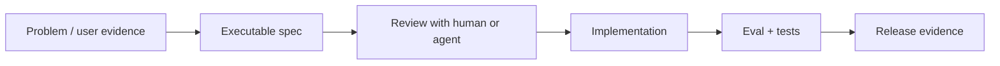

# Spec-Driven Workflow

Build AI features **spec-first**: acceptance cases, eval thresholds, and tool contracts live in the repository *before* large agent diffs. This page shows the same workflow with **[OpenSpec](https://openspec.dev/)** (repo specs) and **[Cursor](https://cursor.com/)** (editor agents).

Every **lab** in AIEBOK includes a spec-driven habit section—use this page as the reference.

## Mental model



Specs are not throwaway planning docs. They are **tests, YAML cases, or OpenSpec requirements** that CI and agents read on every change.

## Choose your stack

| Need | OpenSpec | Cursor |
|---|---|---|
| Persistent requirements in git | `openspec/specs/` by domain | `.cursor/rules/`, `AGENTS.md` |
| Change proposals with review | `openspec/changes/<id>/proposal.md` | Plan mode + PR description |
| Delta requirements | ADDED/MODIFIED/REMOVED in change | Spec file diff in PR |
| Apply implementation | `/opsx:apply` + tasks.md | Agent mode with spec in context |
| Best for | Brownfield features, team alignment | Daily coding, tight feedback loops |

Use **both**: OpenSpec for durable requirements; Cursor to implement tasks against them.

## OpenSpec quick start

**Prerequisites:** Node.js 20.19+

```bash
npm install -g @fission-ai/openspec@latest
cd your-repo
openspec init
openspec update
```

Directory layout after init:

```text
openspec/
  specs/           # current truth — behavior by domain (auth/, rag/, …)
  changes/         # active proposals
  changes/archive/ # completed changes
```

### Commands (assistant slash commands)

| Command | When to use |
|---|---|
| `/opsx:explore` | Fuzzy idea — explore options before writing specs |
| `/opsx:propose` | Ready to define a change — generates proposal, deltas, tasks |
| `/opsx:apply` | Spec approved — implement tasks systematically |
| `/opsx:archive` | Done — merge deltas into `openspec/specs/` |

CLI validation (when available in your install):

```bash
openspec validate
openspec show <change-id>
```

### Example: lab acceptance as a change

```text
/opsx:propose Add lab 0902 acceptance spec for policy abstention and admin approval
```

Review `openspec/changes/<id>/specs/` for requirements like:

```markdown
## ADDED Requirements
### Requirement: Policy abstention
WHEN policy text is unknown, the system SHALL abstain rather than guess.
```

Then:

```text
/opsx:apply
python -m pytest labs/0902-specification-driven-development/test_lab.py -q
/opsx:archive
```

## Cursor quick start

```bash
cursor .
```

### 1. Project rules

Create `.cursor/rules/spec-driven.mdc`:

```markdown
---
description: Spec-first development
globs: "**/*"
---
- Read specs/, openspec/changes/, and failing tests before implementation
- Write or update acceptance cases before changing production logic
- Run pytest (or documented test command) before claiming done
- Minimal diff: implement only what the spec requires
```

### 2. Plan mode (spec review)

```text
Read specs/lab-0902-acceptance.yaml and test_lab.py.
What normal, boundary, and adversarial cases are missing?
Propose a plan that does not expand scope beyond the spec.
```

### 3. Agent mode (implementation)

```text
Implement the plan. Touch only files listed in tasks.
After edits run: python -m pytest labs/0902-specification-driven-development/test_lab.py -q
```

### 4. Skills (repeatable workflows)

Store under `.cursor/skills/` — e.g. `spec-to-green/SKILL.md`:

```markdown
# Spec to green
1. Read active OpenSpec change or specs/*.yaml
2. Run tests; note failures
3. Minimal fix; re-run tests
4. Summarize spec coverage in PR description
```

See [Coding agent workspace](../guides/coding-agent-workspace.md).

## Copy-paste templates

### Acceptance YAML (any lab)

```yaml
# specs/lab-0305-acceptance.yaml
lab: "03.05 similarity and vector search"
cases:
  - name: paraphrase_ranks_higher
    input: { query: "system outage", docs: ["network failure", "weather"] }
    expect: "network failure"
  - name: orthogonal_vectors
    input: { query: [1, 0], docs: [[0, 1]] }
    expect_max_score: 0.01
```

### Pytest-first (same discipline)

```python
# test_lab.py — written before main.py changes
def test_abstains_on_unknown_policy():
    assert "abstain" in run("unknown policy")
```

### AGENTS.md excerpt

```markdown
## Spec-driven workflow
1. Read `specs/` or `openspec/changes/<active>/`
2. `python -m pytest test_lab.py -q` must pass before PR
3. Do not edit `.env` or generated locks
```

## Where this appears in AIEBOK

- **Book 9.2** — [Specification-Driven Development](../books/09-ai-software-and-product-engineering/02-specification-driven-development.md)
- **Every lab README** — spec-driven habit section with Cursor + OpenSpec commands
- **Starter notebooks** — spec-first checkpoint cell before coding
- **Guides** — [Spec-to-production](../guides/spec-to-production-feature.md), [Coding agent workspace](../guides/coding-agent-workspace.md)
- **Learning paths** — [Coding-agent specialist](learning-paths/02-coding-agent-specialist.md)

## Related

- [Pattern: Spec-Driven AI Feature](../patterns/spec-driven-ai-feature.md)
- [Lab 9.2](../labs/0902-specification-driven-development.md)
- [Eval-gated release](../guides/eval-gated-release.md)
