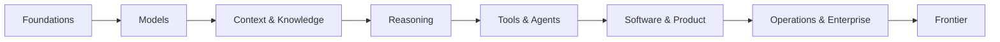

# AI Engineering Body of Knowledge

**A durable, open curriculum for understanding, building, evaluating, and operating AI systems.**

AIEBOK teaches principles before products and makes implementation, architecture, research literacy, trade-offs, and evolution explicit in every knowledge area.

!!! tip "New here?"
    Start with the **[newcomer guide](getting-started/newcomer-guide.md)** (site map + first-week plan), then **[hands-on start](labs/start-here.md)** for Labs 1–5.  
    For local setup, see [first 30 minutes](getting-started/first-30-minutes.md) or a [learning path](getting-started/learning-paths.md).

## Publication at a glance

- 13 guided books
- 78 full study chapters
- 20 knowledge-area maps
- Concept, pattern, architecture, cloud, lab, and research libraries
- Approximately 70,000 words of deployable learning content

## The whole field, one map

## What makes this different

- **Enduring theory:** concepts expected to outlive current libraries.
- **Modern engineering:** current ways of implementing those concepts.
- **Code practice:** build important mechanisms once, then use mature tools.
- **Architecture studios:** reason about scale, safety, cost, and failure.
- **Research reading:** learn how to interpret new papers and protocols.
- **Evolution lens:** yesterday, today, tomorrow, and the principle that survives.
- **Decision quality:** benefits, costs, alternatives, and when not to use something.

## Content layers

| Layer | Use it for |
|---|---|
| Knowledge areas | A guided, comprehensive curriculum |
| Concept cards | Fast explanations and prerequisite links |
| Patterns | Reusable engineering solutions |
| Architectures | End-to-end system designs and trade-offs |
| Cloud maps | AWS, Azure, and Google Cloud implementations |
| Labs | Hands-on intuition and portfolio work |
| Research | Landmark papers and a repeatable reading method |

## Repository status

This starter is deliberately an **open publication, not an LMS**. It has no accounts, backend, database, tracking, or paid infrastructure. Markdown is the source of truth; GitHub Pages is the host.
