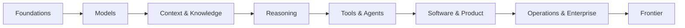

# AI Engineering Body of Knowledge

**A durable, open curriculum for understanding, building, evaluating, and operating AI systems.**

AIEBOK teaches principles before products and makes implementation, architecture, trade-offs, and evolution explicit in every knowledge area.

!!! tip "New here?"
    Start with the **[newcomer guide](getting-started/newcomer-guide.md)** (site map + first-week plan), then **[hands-on start](labs/start-here.md)** for Labs 1–5.  
    For local setup, see [first 30 minutes](getting-started/first-30-minutes.md) or a [learning path](getting-started/learning-paths/index.md).

## Publication at a glance

<!-- site-stats:publication:start -->
- 13 guided books
- 78 full study chapters
- 20 knowledge-area maps
- 163 guided lessons (120 knowledge-area + 43 supplemental)
- 361 concept cards (43 featured deep-dives)
- 100 patterns (98 catalog + 2 starter deep-dives)
- 25 architecture studios
- 13 build guides · 26 cloud capability guides
- 83 labs (78 chapter + 5 starter) · 13 code samples
- approximately 340,000 words of deployable learning content in `docs/`
<!-- site-stats:publication:end -->

## Explore the curriculum

<!-- site-stats:home-cards:start -->

-   :material-map-legend:{ .lg .middle } __Start with orientation__

    Newcomer guide, first 30 minutes, and role-based learning paths.

    [Newcomer guide →](getting-started/newcomer-guide.md)

-   :material-book-open-variant:{ .lg .middle } __Read sequentially__

    13 guided books · 78 chapters with diagrams and knowledge checks.

    [Book catalog →](books/index.md)

-   :material-flask:{ .lg .middle } __Build hands-on__

    5 starter labs + 78 chapter labs with notebooks and tests.

    [Hands-on start →](labs/start-here.md)

-   :material-card-search:{ .lg .middle } __Look up fast__

    361 concept cards, 100 patterns, 25 architecture studios.

    [Concept index →](concepts/index.md)

-   :material-school:{ .lg .middle } __Short lessons__

    163 guided lessons linked to chapters, objectives, and labs.

    [Lesson catalog →](lessons/index.md)

-   :material-cloud:{ .lg .middle } __Design for production__

    Patterns, cloud maps, and 13 build guides.

    [Pattern library →](patterns/index.md)

<!-- site-stats:home-cards:end -->

## The whole field, one map

## What makes this different

- **Enduring theory:** concepts expected to outlive current libraries.
- **Modern engineering:** current ways of implementing those concepts.
- **Code practice:** build important mechanisms once, then use mature tools.
- **Architecture studios:** reason about scale, safety, cost, and failure.
- **Evolution lens:** yesterday, today, tomorrow, and the principle that survives.
- **Decision quality:** benefits, costs, alternatives, and when not to use something.

## Content layers

| Layer | Use it for |
|---|---|
| Knowledge areas | A guided, comprehensive curriculum |
| Concept cards | Fast explanations and prerequisite links |
| Patterns | Reusable engineering solutions |
| Architectures | End-to-end system designs and trade-offs |
| Cloud maps | AWS, Azure, and Google Cloud implementations |
| Labs | Hands-on intuition and portfolio work |
| Build guides | End-to-end projects from spec to evidence |

## Repository status

This starter is deliberately an **open publication, not an LMS**. It has no accounts, backend, database, tracking, or paid infrastructure. Markdown is the source of truth; GitHub Pages is the host.
