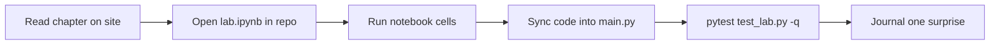

# Hands-on Start

Five **starter labs** teach core AI-engineering mechanics in order. Complete them before diving into the 78 chapter labs.

!!! info "Before you begin"
    1. [Clone the repository](https://github.com/mahalingam-inapp/aiebok){target="_blank" rel="noopener"} (or open in **Codespaces** / the Dev Container).
    2. Create a virtualenv and install dependencies — see [First 30 minutes](../getting-started/first-30-minutes.md).
    3. Work from the repo root unless a lab README says otherwise.

## Starter track (do in order)

Each lab has `main.py`, `test_lab.py`, README, and a guided **`lab.ipynb`** in the repository.

| Step | Skill | Read first | Run in repo | Open notebook |
|:---:|---|---|---|---|
| **1** | Vector similarity | [Similarity & vector search](../books/03-language-and-representation/05-similarity-and-vector-search.md) | `python labs/01-cosine-similarity/main.py` | [`lab.ipynb`](https://github.com/mahalingam-inapp/aiebok/blob/main/labs/01-cosine-similarity/lab.ipynb){target="_blank" rel="noopener"} |
| **2** | Lexical / embedding search | [Embedding systems](../books/03-language-and-representation/06-embedding-systems-in-production.md) | `python labs/02-semantic-search/main.py` | [`lab.ipynb`](https://github.com/mahalingam-inapp/aiebok/blob/main/labs/02-semantic-search/lab.ipynb){target="_blank" rel="noopener"} |
| **3** | RAG stages | [Retrieval](../books/06-knowledge-and-retrieval-systems/03-retrieval.md) | `python labs/03-basic-rag/main.py` | [`lab.ipynb`](https://github.com/mahalingam-inapp/aiebok/blob/main/labs/03-basic-rag/lab.ipynb){target="_blank" rel="noopener"} |
| **4** | Bounded agent loop | [The agent loop](../books/08-agent-systems/02-the-agent-loop.md) | `python labs/04-agent-loop/main.py` | [`lab.ipynb`](https://github.com/mahalingam-inapp/aiebok/blob/main/labs/04-agent-loop/lab.ipynb){target="_blank" rel="noopener"} |
| **5** | Eval gates & slices | [Evaluation as requirements](../books/10-evaluation-safety-and-governance/01-evaluation-as-requirements.md) | `python labs/05-eval-harness/main.py` | [`lab.ipynb`](https://github.com/mahalingam-inapp/aiebok/blob/main/labs/05-eval-harness/lab.ipynb){target="_blank" rel="noopener"} |

## Workflow for each lab



1. Skim the lab README in `labs/0X-*/README.md`.
2. Open the notebook link (opens GitHub or your local Jupyter).
3. Complete **Your turn** sections in the notebook.
4. Copy finished functions into `main.py`.
5. From the lab directory: `python -m pytest test_lab.py -q`.

!!! tip "Jupyter in Codespaces"
    ```bash
    pip install -r requirements.txt
    jupyter lab labs/01-cosine-similarity/lab.ipynb
    ```

## After the starter track

- Browse the full [lab catalog](catalog.md) — chapter labs match book numbers (`labs/0603-retrieval/` → Book 06, ch. 3).
- Return to the [newcomer guide](../getting-started/newcomer-guide.md) for a role-based reading plan.
- Explore [patterns](../patterns/index.md) and [architectures](../architectures/index.md) once you can run Labs 1–5 confidently.

## Quick links

- [Lab guide](index.md) — all starter + chapter labs
- [Starter notebooks index](notebooks/index.md) — notebook paths only
- [Repository root](https://github.com/mahalingam-inapp/aiebok){target="_blank" rel="noopener"}
