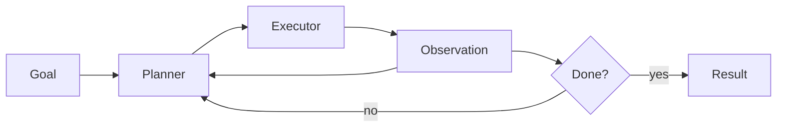

# Planner–Executor

## Context

A task has multiple dependent steps, but executing and revising a plan in one unconstrained loop is difficult to observe and control.

## Solution

Separate a planner that produces or revises explicit steps from an executor that performs one bounded step and returns observations.

## Consequences

Clearer traces and recovery, but more calls, state, latency, and opportunities for plan drift. Require step budgets, typed state, tool policies, and termination checks.

## Do not use when

A deterministic workflow already describes the task or a single call reliably solves it.
